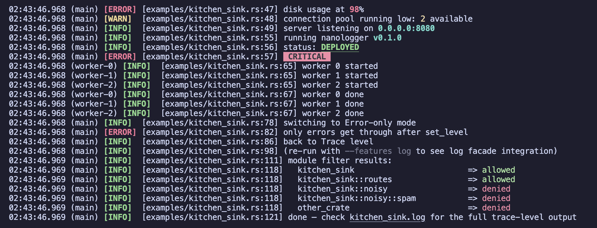

# 🪵 nanologger [](https://crates.io/crates/nanologger) [](https://docs.rs/nanologger/latest/nanologger/) [](https://github.com/anthonysgro/nanologger/actions) [](https://coveralls.io/github/anthonysgro/nanologger?branch=main) [](https://crates.io/crates/nanologger)

A minimal logger for Rust.

Part of the [nano](https://github.com/anthonysgro/nano) crate family — minimal, zero-dependency building blocks for Rust.

Colored, leveled logging to stderr with `format!`-style macros, optional timestamps, source locations, thread info, module filtering, file logging, and `log` facade integration — all in a single file with minimal dependencies.



## Motivation

Most Rust logging crates are feature-rich but pull in large dependency trees or offer far more than you need. If all you want is colored leveled output to stderr and maybe a log file, those crates are overkill.

`nanologger` solves this by providing the essentials and nothing more:

- Colored, bold level prefixes (via nanocolor) with automatic TTY detection
- Five log macros: `error!`, `warn!`, `info!`, `debug!`, `trace!`
- One-liner initialization with sensible defaults
- Optional timestamps, source locations, and thread info
- File/writer logging in plain text
- Combined logger with per-output level filtering
- Module allow/deny filtering
- Runtime level changes
- Environment variable configuration (`NANOLOGGER_LEVEL`)
- Optional `log` facade backend (feature flag)

## Comparison

nanologger is intentionally minimal. If you need structured logging, spans, async instrumentation, or regex-based env filtering, use `tracing` or `env_logger` — they're great crates.

nanologger is for when you just want colored leveled output to stderr and maybe a log file, without pulling in a dependency tree.

| Feature | `nanologger` | `simplelog` | `env_logger` | `tracing` |
|---------|:---------:|:-----------:|:------------:|:---------:|
| Dependencies (transitive) | 2* | 11 | 15 | 16† |
| Clean build (release) | ~0.3s | ~2.0s | ~3.8s | ~3.0s |
| Colored output | ✓ | ✓ | ✓ | ✓‡ |
| File / Write logging | ✓ | ✓ | ✗ | ✓‡ |
| Combined logger | ✓ | ✓ | ✗ | ✓‡ |
| Per-output level filter | ✓ | ✓ | ✗ | ✓‡ |
| Module filtering | ✓ | ✓ | ✓ | ✓‡ |
| Source location | ✓ | ✓ | ✗ | ✓‡ |
| Thread info | ✓ | ✓ | ✗ | ✓‡ |
| Timestamps | ✓ | ✓ | ✓ | ✓‡ |
| Runtime level changes | ✓ | ✗ | ✓ | ✓ |
| Env var configuration | ✓ | ✗ | ✓ | ✓‡ |
| `log` facade backend | ✓ | ✓ | ✓ | ✓ |
| Structured logging / spans | ✗ | ✗ | ✗ | ✓ |
| Regex-based filtering | ✗ | ✗ | ✓ | ✓‡ |
| Async instrumentation | ✗ | ✗ | ✗ | ✓ |

\* nanocolor and nanotime, both zero-dependency crates themselves. † `tracing` + `tracing-subscriber` (the typical setup). ‡ Via `tracing-subscriber`.

Build times measured on Apple M1 with `cargo build --release` from a clean state.

## Quick Start ([demo](examples/demo.rs))

```sh
cargo add nanologger
```

```rust
use nanologger::{LoggerBuilder, LogLevel};

fn main() {
    LoggerBuilder::new()
        .level(LogLevel::Trace)
        .timestamps(true)
        .init()
        .unwrap();

    nanologger::error!("something went wrong: {}", "disk full");
    nanologger::warn!("retries remaining: {}", 3);
    nanologger::info!("server started on port {}", 8080);
    nanologger::debug!("request payload: {:?}", vec![1, 2, 3]);
    nanologger::trace!("entering function");
}
```

Or with the simplest possible setup:

```rust
fn main() {
    nanologger::init().unwrap(); // defaults to Info level, no timestamps
    nanologger::info!("hello");
}
```

## Usage

### Basic logging

```rust
use nanologger::{LoggerBuilder, LogLevel};

LoggerBuilder::new()
    .level(LogLevel::Debug)
    .init()
    .unwrap();

nanologger::error!("critical failure");
nanologger::warn!("something looks off");
nanologger::info!("server started on port {}", 8080);
nanologger::debug!("request payload: {:?}", vec![1, 2, 3]);
nanologger::trace!("this won't appear — below Debug level");
```

Messages at or above the configured level are written to stderr with colored prefixes. Messages below the level are silently discarded. Calling a log macro before initialization is safe — it's a no-op.

### Timestamps

```rust
LoggerBuilder::new()
    .level(LogLevel::Info)
    .timestamps(true)
    .init()
    .unwrap();

nanologger::info!("with timestamp"); // "14:30:05.042 [INFO]  with timestamp"
```

### Source location ([example](examples/source_location.rs))

```rust
LoggerBuilder::new()
    .level(LogLevel::Trace)
    .source_location(true)
    .init()
    .unwrap();

nanologger::info!("started"); // "[INFO]  [src/main.rs:8] started"
```

### Thread info ([example](examples/thread_info.rs))

```rust
LoggerBuilder::new()
    .level(LogLevel::Trace)
    .thread_info(true)
    .timestamps(true)
    .init()
    .unwrap();

nanologger::info!("from main"); // "14:30:05.042 (main) [INFO]  from main"

std::thread::Builder::new()
    .name("worker-1".into())
    .spawn(|| {
        nanologger::info!("from worker"); // "14:30:05.043 (worker-1) [INFO]  from worker"
    })
    .unwrap()
    .join()
    .unwrap();
```

Named threads show their name; unnamed threads show `ThreadId(N)`.

### Environment variable ([example](examples/env_level.rs))

The builder reads `NANOLOGGER_LEVEL` from the environment automatically. If unset or invalid, it defaults to `Info`.

```sh
NANOLOGGER_LEVEL=trace cargo run
```

### Runtime level changes

```rust
nanologger::set_level(LogLevel::Trace);  // open the floodgates
nanologger::set_level(LogLevel::Error);  // quiet down
```

### File logging ([example](examples/write_logger.rs))

```rust
use nanologger::{LogLevel, LogOutput, LoggerBuilder};
use std::fs::File;

let file = File::create("app.log").expect("failed to create log file");

LoggerBuilder::new()
    .level(LogLevel::Debug)
    .add_output(LogOutput::writer(LogLevel::Debug, file))
    .init()
    .unwrap();
```

Writer outputs always produce plain text (no ANSI codes).

### Combined logger ([example](examples/combined_logger.rs))

Route different severity levels to different destinations:

```rust
use nanologger::{LogLevel, LogOutput, LoggerBuilder};
use std::fs::File;

let file = File::create("verbose.log").unwrap();

LoggerBuilder::new()
    .level(LogLevel::Trace)
    .add_output(LogOutput::term(LogLevel::Warn))           // terminal: Warn and above
    .add_output(LogOutput::writer(LogLevel::Trace, file))   // file: everything
    .init()
    .unwrap();
```

Each output applies its own level filter independently.

### Module filtering ([example](examples/module_filter.rs))

```rust
LoggerBuilder::new()
    .level(LogLevel::Trace)
    .module_allow(vec!["myapp::db".into()])
    .module_deny(vec!["myapp::db::pool".into()])
    .add_output(LogOutput::term(LogLevel::Trace))
    .init()
    .unwrap();
```

- Allow list: only emit messages from matching module prefixes (empty = allow all)
- Deny list: discard messages from matching module prefixes
- Allow is applied first, then deny

### Test logger ([example](examples/test_logger.rs))

For use in `#[test]` functions — output is captured by Rust's test harness:

```rust
LoggerBuilder::new()
    .level(LogLevel::Debug)
    .add_output(LogOutput::test(LogLevel::Debug))
    .init()
    .unwrap();
```

Output is plain text via `print!()`, so it only appears on test failure (or with `--nocapture`).

### Colored message content ([example](examples/colored_messages.rs))

nanologger re-exports nanocolor's `Colorize` trait, `style()` helper, and `StyledString`, so you can style log message content without adding nanocolor as a separate dependency:

```rust
use nanologger::{info, error, Colorize, style};

info!("server listening on {}", "127.0.0.1:3000".cyan());
error!("connection to {} failed", "db-primary".red().bold());

let version = style(format!("v{}.{}.{}", 0, 1, 0)).cyan().bold();
info!("running nanologger {}", version);
```

### Disabling colors ([example](examples/disable_colors.rs))

Colors are on by default when stderr is a TTY, and off when piped. You can also control them explicitly:

```sh
# Via environment variable (respected by nanocolor)
NO_COLOR=1 cargo run
```

```rust
// Or programmatically
nanocolor::set_colors_override(false);  // force colors off
nanocolor::clear_colors_override();     // restore automatic TTY detection
```

### `log` facade integration ([example](examples/log_facade.rs))

Enable the `log` feature to use nanologger as a backend for the `log` crate:

```toml
[dependencies]
nanologger = { version = "0.1.0", features = ["log"] }
```

```rust
use nanologger::{LogLevel, LoggerBuilder};

LoggerBuilder::new()
    .level(LogLevel::Trace)
    .init()
    .unwrap();

// log crate macros now route through nanologger
log::info!("from the log facade");

// nanologger's own macros still work alongside
nanologger::info!("from nanologger directly");
```

### Kitchen sink ([example](examples/kitchen_sink.rs))

Every feature in one place — timestamps, source location, thread info, module filtering, combined logger with per-output levels, styled content, runtime level changes, and log facade integration:

```rust
use nanologger::{
    info, warn, error, debug, trace,
    Colorize, style,
    LogLevel, LogOutput, LoggerBuilder,
};
use std::fs::File;

fn main() {
    let file = File::create("kitchen_sink.log").unwrap();

    LoggerBuilder::new()
        .level(LogLevel::Trace)
        .timestamps(true)
        .source_location(true)
        .thread_info(true)
        .module_allow(vec!["kitchen_sink".into()])
        .module_deny(vec!["kitchen_sink::noisy".into()])
        .add_output(LogOutput::term(LogLevel::Info))
        .add_output(LogOutput::writer(LogLevel::Trace, file))
        .init()
        .unwrap();

    error!("disk usage at {}%", 98.red().bold());
    warn!("pool running low: {} available", 2.yellow());
    info!("listening on {}", "0.0.0.0:8080".cyan().bold());
    debug!("loaded {} routes", 42);
    trace!("entering main()");

    let version = style(format!("v{}.{}.{}", 0, 1, 0)).cyan().bold();
    info!("running nanologger {version}");

    nanologger::set_level(LogLevel::Error);
    warn!("hidden after set_level(Error)");
    error!("only errors now");
}
```

```sh
cargo run --example kitchen_sink
cargo run --example kitchen_sink --features log   # with log facade
```

Terminal shows Info+, the file gets everything. Check `kitchen_sink.log` for the full trace-level output.

## Message format

```
{timestamp} {(thread)} {[LEVEL]} {[file:line]} {message}
```

Each segment is omitted when its feature is disabled. Colors and bold are applied to the level tag when stderr is a TTY; plain text otherwise.

| Level | Color | Tag |
|-------|-------|-----|
| Error | Red bold | `[ERROR]` |
| Warn | Yellow bold | `[WARN]` |
| Info | Green bold | `[INFO]` |
| Debug | Blue bold | `[DEBUG]` |
| Trace | Magenta bold | `[TRACE]` |

## API Reference

### `LogLevel`

```rust
pub enum LogLevel {
    Error = 0,
    Warn = 1,
    Info = 2,
    Debug = 3,
    Trace = 4,
}
```

| Method | Returns | Description |
|--------|---------|-------------|
| `LogLevel::from_str(s)` | `Result<LogLevel, ParseLevelError>` | Parse from string (case-insensitive) |
| `Display` (format!) | — | Lowercase: `"error"`, `"warn"`, etc. |
| `.as_u8()` | `u8` | Numeric representation (0–4) |
| `LogLevel::from_u8(val)` | `Option<LogLevel>` | From numeric value. `None` for > 4 |
| `.tag()` | `String` | Bracketed uppercase tag, e.g. `[ERROR]` |

### `LoggerBuilder`

| Method | Returns | Description |
|--------|---------|-------------|
| `LoggerBuilder::new()` | `LoggerBuilder` | New builder. Reads `NANOLOGGER_LEVEL` env var, defaults to `Info` |
| `.level(level)` | `Self` | Set minimum log level |
| `.get_level()` | `LogLevel` | Get currently configured level |
| `.timestamps(enabled)` | `Self` | Enable/disable `HH:MM:SS.mmm` timestamp prefix |
| `.source_location(enabled)` | `Self` | Enable/disable `[file:line]` in output |
| `.thread_info(enabled)` | `Self` | Enable/disable thread name/ID in output |
| `.module_allow(modules)` | `Self` | Set module allow list (prefix matching) |
| `.module_deny(modules)` | `Self` | Set module deny list (prefix matching) |
| `.add_output(output)` | `Self` | Add an output destination |
| `.init()` | `Result<(), InitError>` | Initialize the global logger. Errors if already initialized |

### `LogOutput`

| Constructor | Description |
|-------------|-------------|
| `LogOutput::term(level)` | Stderr with color support. Applies its own level filter |
| `LogOutput::writer(level, w)` | Any `impl Write + Send + 'static`. Plain text, own level filter |
| `LogOutput::test(level)` | Via `print!()`, captured by test harness. Plain text, own level filter |

### Free functions

| Function | Description |
|----------|-------------|
| `nanologger::init()` | Initialize with defaults (Info level, stderr, no timestamps) |
| `nanologger::set_level(level)` | Change global log level at runtime. No-op if not initialized |
| `nanologger::matches_module_filter(path, allow, deny)` | Check if a module path passes the filter |

### Macros

| Macro | Level |
|-------|-------|
| `nanologger::error!(...)` | Error |
| `nanologger::warn!(...)` | Warn |
| `nanologger::info!(...)` | Info |
| `nanologger::debug!(...)` | Debug |
| `nanologger::trace!(...)` | Trace |

All macros accept `format!`-style arguments. Safe to call before initialization (no-op).

### Re-exports from nanocolor

| Item | Description |
|------|-------------|
| `Colorize` | Trait for `.red()`, `.bold()`, `.cyan()`, etc. on strings and values |
| `style(value)` | Wrap a value for styling (useful for formatted/dynamic values) |
| `StyledString` | The styled string type returned by `Colorize` methods |

## Contributing

Contributions are welcome. To get started:

1. Fork the repository
2. Create a feature branch (`git checkout -b my-feature`)
3. Make your changes
4. Run the tests: `cargo test`
5. Submit a pull request

Please keep changes minimal and focused. This crate's goal is to stay small and dependency-light.

## License

This project is licensed under the [MIT License](LICENSE).
